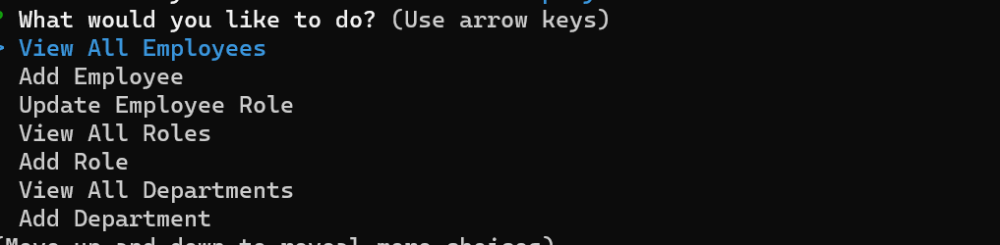

# Employee-Tracker

## Description
This employee tracker only uses the terminal to prompt the user questions about the company database. It gives the user the choice to view all employees, departments, and their roles. This also gives the option modify any of the prompts as well. The motivation behind this application was to test my knowledge of using mySQL and the inquirer package as well and incorporating all of it in javascript.

## Usage

## Installation
Please run the command: npm i to install all the necessary packages needed to run this application!
https://drive.google.com/file/d/1CCNT0l9rpDO2E3iJs3mYKSrh71_vJvA-/view 